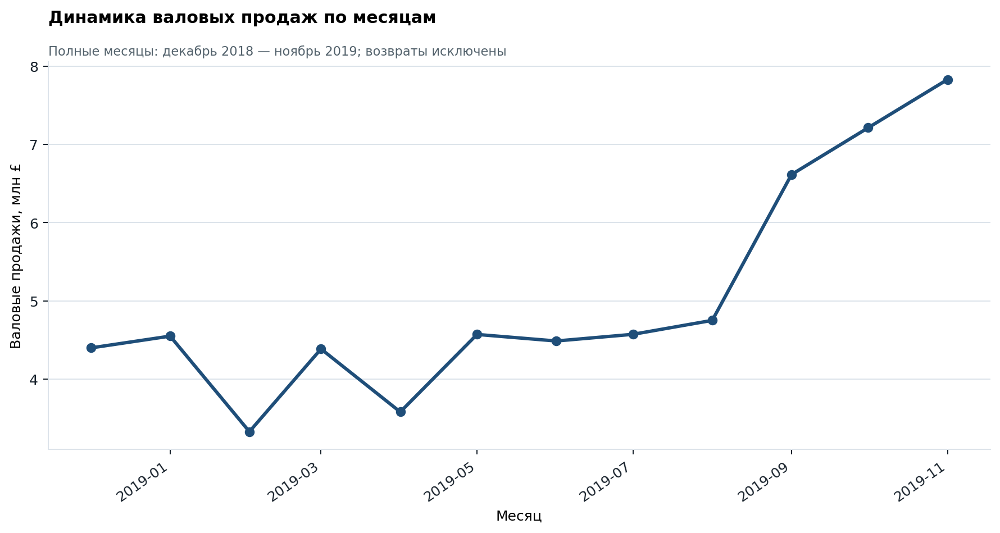
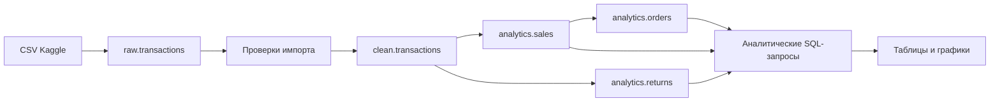

# Анализ продаж интернет-магазина в PostgreSQL

Портфолио-проект показывает полный путь данных: импорт исходного CSV в PostgreSQL, проверку качества, очистку, построение аналитических представлений и бизнес-анализ SQL-запросами. DBeaver используется как клиент для подключения к базе и запуска скриптов.



## Ключевые результаты

| Показатель | Результат |
|---|---:|
| Исходные строки | 536 350 |
| Строки после очистки и агрегации | 526 417 |
| Строки продаж | 517 898 |
| Строки возвратов | 8 519 |
| Уникальные заказы с продажами | 19 790 |
| Валовые продажи | £62 781 386,54 |
| Сумма возвратов | £2 664 628,15 |
| Чистая сумма операций | £60 116 758,39 |
| Средний чек продажи | £3 172,38 |

Все 11 контрольных проверок в [`06_full_audit.sql`](sql/06_full_audit.sql) завершились со статусом `PASS`. Машиночитаемые результаты сохранены в [`docs/results`](docs/results).

## Выводы

- Великобритания формирует £52 346 877,60, или **83,38%** валовых продаж. Расчёт: `52 346 877,60 / 62 781 386,54 × 100`.
- Сумма возвратов эквивалентна **4,24%** валовых продаж. Расчёт: `2 664 628,15 / 62 781 386,54 × 100`. Это отношение денежных сумм, а не доля возвращённых заказов.
- В ноябре 2019 валовые продажи составили £7 828 489,53 против £4 749 801,23 в августе — рост **64,82%**. Расчёт: `(7 828 489,53 / 4 749 801,23 − 1) × 100`.
- Товар `Paper Craft Little Birdie` лидирует по валовым продажам: £1 002 718,10. Одновременно по нему зафиксирована крупная сумма возвратов — £501 359,05, поэтому позиция требует отдельной проверки причин возврата.
- Декабрь 2019 исключён из помесячного графика как неполный месяц: данные заканчиваются 9 декабря.

Подробные таблицы и осторожная интерпретация находятся в [`docs/findings.md`](docs/findings.md).

## Структура проекта

```text
ecommerce-sales-postgresql/
├── data/
│   └── README.md                   # источник и инструкция загрузки данных
├── docs/
│   ├── data_dictionary.md          # описание полей и преобразований
│   ├── findings.md                 # результаты и ограничения анализа
│   └── results/                    # CSV с проверочными результатами
├── images/                         # графики для README
├── scripts/
│   └── generate_portfolio_assets.py
├── sql/
│   ├── 01_create_tables.sql
│   ├── 02_check_import.sql
│   ├── 03_prepare_data.sql
│   ├── 04_check_results.sql
│   ├── 05_analysis.sql
│   └── 06_full_audit.sql
├── .gitignore
├── README.md
└── requirements.txt
```

## Архитектура



## Что демонстрирует проект

- PostgreSQL: схемы, таблицы, представления и приведение типов;
- очистку данных через CTE, `NULLIF`, `COALESCE`, `DISTINCT`, `GROUP BY`;
- контроль качества с ожидаемыми значениями и статусами `PASS/FAIL`;
- агрегации, фильтрацию, расчёт среднего чека и анализ по времени;
- разделение слоёв `raw`, `clean` и `analytics`;
- воспроизводимую подготовку результатов и графиков.

## Как воспроизвести проект

Проект проверен в PostgreSQL 18.6 и DBeaver 26.2.0 на Windows. Пароли и локальные настройки подключения в репозиторий не добавляются.

### 1. Подготовить базу

Под пользователем-администратором PostgreSQL создайте отдельного пользователя и базу. Вместо `<YOUR_PASSWORD>` укажите собственный пароль:

```sql
CREATE ROLE ecommerce_user WITH LOGIN PASSWORD '<YOUR_PASSWORD>';
CREATE DATABASE ecommerce OWNER ecommerce_user;
```

В DBeaver создайте соединение с параметрами:

```text
Host: localhost
Port: 5432
Database: ecommerce
User: ecommerce_user
```

### 2. Скачать данные

Скачайте CSV со страницы [E-commerce Business Transaction на Kaggle](https://www.kaggle.com/datasets/gabrielramos87/an-online-shop-business). Инструкция и контрольная сумма использованного файла приведены в [`data/README.md`](data/README.md).

### 3. Создать структуру

Откройте и выполните целиком [`01_create_tables.sql`](sql/01_create_tables.sql). Скрипт создаст схемы `raw`, `clean`, `analytics` и пустую таблицу `raw.transactions` с восемью текстовыми столбцами.

### 4. Импортировать CSV через DBeaver

1. Нажмите правой кнопкой на `raw.transactions` → **Импорт данных**.
2. Выберите `CSV`, затем исходный файл.
3. Установите кодировку `UTF-8`, разделитель `,`, кавычку `"` и наличие заголовка.
4. Сопоставьте восемь столбцов CSV с восемью столбцами таблицы.
5. Не создавайте дополнительные столбцы и не включайте `Drop and create the table`.
6. Выполните импорт. Ожидаемое число строк — `536350`.

Все поля слоя `raw` намеренно имеют тип `text`: преобразование и проверка выполняются явно в следующем слое.

### 5. Выполнить SQL-пайплайн

Запускайте файлы по порядку:

1. [`02_check_import.sql`](sql/02_check_import.sql) — проверка числа строк, пустых значений, дат и чисел;
2. [`03_prepare_data.sql`](sql/03_prepare_data.sql) — очистка и создание аналитических представлений;
3. [`04_check_results.sql`](sql/04_check_results.sql) — проверка итоговых объектов и сумм;
4. [`05_analysis.sql`](sql/05_analysis.sql) — бизнес-запросы;
5. [`06_full_audit.sql`](sql/06_full_audit.sql) — единый набор контрольных тестов.

`03_prepare_data.sql` рассчитан на однократный запуск в новой базе. Остальные проверочные и аналитические скрипты можно выполнять повторно.

### 6. Обновить графики

Python используется только для статических изображений README; основной анализ выполняется в PostgreSQL.

```powershell
python -m venv .venv
.\.venv\Scripts\Activate.ps1
pip install -r requirements.txt
python scripts\generate_portfolio_assets.py --csv "C:\path\to\Sales Transaction v.4a.csv"
```

## Источник данных

Набор [E-commerce Business Transaction](https://www.kaggle.com/datasets/gabrielramos87/an-online-shop-business), автор Gabriel Ramos. Страница источника описывает данные как транзакции британского интернет-магазина за один год, цену — в фунтах стерлингов, а лицензию — как CC0: Public Domain. Сам CSV не включён в репозиторий: это сохраняет небольшой размер проекта и заставляет воспроизводить этап загрузки явно.

## Ограничения

- Валовые продажи не равны прибыли: в данных нет себестоимости и операционных расходов.
- `CustomerNo = -1` — техническая замена для 55 отсутствующих идентификаторов клиентов.
- Удаляются только полностью одинаковые исходные строки; это правило очистки должно оцениваться с учётом бизнес-контекста.
- Показатели описывают предоставленный набор данных и не доказывают причинно-следственные связи.

