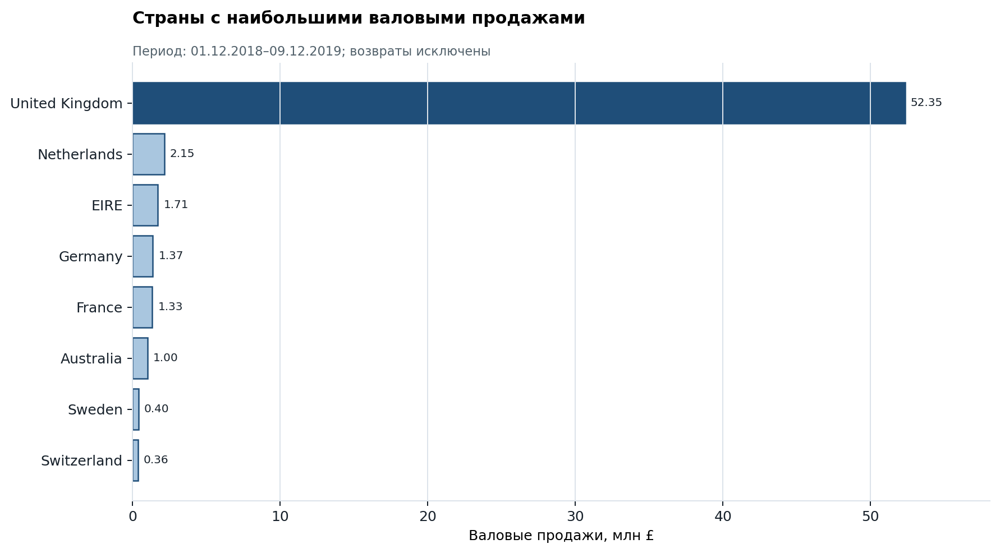
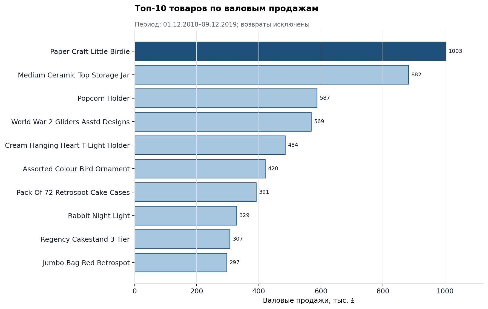

# Результаты анализа

## Проверенные показатели

Показатели ниже получены двумя способами: SQL-аудитом в PostgreSQL и локальным скриптом, повторяющим правила очистки. Контрольные значения совпали.

| Метрика | Значение | Определение |
|---|---:|---|
| Исходные строки | 536 350 | число строк в `raw.transactions` |
| Очищенные строки | 526 417 | строки после точного удаления дублей и объединения одинаковых товарных позиций |
| Продажи | 517 898 | строки с `quantity > 0` |
| Возвраты | 8 519 | строки с `quantity < 0` |
| Заказы | 19 790 | уникальные `transaction_no` среди продаж |
| Валовые продажи | £62 781 386,54 | сумма `price × quantity` для положительных количеств |
| Сумма возвратов | £2 664 628,15 | абсолютная сумма отрицательных операций |
| Чистая сумма операций | £60 116 758,39 | продажи с учётом отрицательных операций |
| Средний чек продажи | £3 172,38 | среднее значение суммы заказа среди продаж |

## География

Великобритания — крупнейший рынок в наборе: £52 346 877,60 и 17 908 заказов. Доля в валовых продажах составляет `52 346 877,60 / 62 781 386,54 × 100 = 83,38%`.

Высокая концентрация означает зависимость результата от одного рынка. Это наблюдение о структуре данных, а не доказательство бизнес-риска без дополнительной информации о стратегии компании.

## Динамика

Валовые продажи выросли с £4 749 801,23 в августе до £7 828 489,53 в ноябре 2019. Относительное изменение: `(7 828 489,53 / 4 749 801,23 − 1) × 100 = 64,82%`.

Декабрь 2019 не включён в сравнение месяцев, потому что набор заканчивается 9 декабря. Рост в конце периода может быть связан с сезонностью, но подтвердить причину по этим данным нельзя.

## Товары

Лидер по валовым продажам — `Paper Craft Little Birdie`: 80 995 проданных единиц на £1 002 718,10. У этой позиции также £501 359,05 возвратов. У `Medium Ceramic Top Storage Jar` валовые продажи составляют £881 990,18, а сумма возвратов — £843 277,96. Эти позиции стоит исследовать на уровне транзакций; по агрегатам нельзя установить причину или фактическую долю возвращённых заказов.

## Возвраты

Отношение общей суммы возвратов к валовым продажам равно `2 664 628,15 / 62 781 386,54 × 100 = 4,24%`.

Это показатель отношения денежных сумм. Он не называется «процентом возвращённых заказов», потому что знаменатель и числитель рассчитаны по операциям и не связывают каждый возврат с исходной продажей.

## Ограничения интерпретации

- В данных нет себестоимости, маркетинговых расходов и логистики, поэтому прибыль и маржинальность не рассчитываются.
- Отсутствующие 55 значений `CustomerNo` заменены техническим идентификатором `-1` и исключаются из анализа повторных клиентов.
- Точная дедупликация и объединение идентичных позиций — принятые правила проекта, а не подтверждённые бизнесом правила учёта.
- Неполный декабрь 2019 исключён только из помесячного тренда, но остаётся в итоговых суммах за весь период.
- Данные позволяют описывать связи и структуру продаж, но не доказывают причины наблюдаемых изменений.

